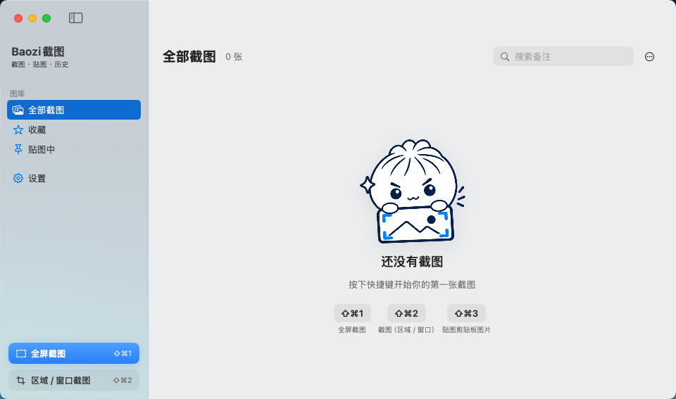
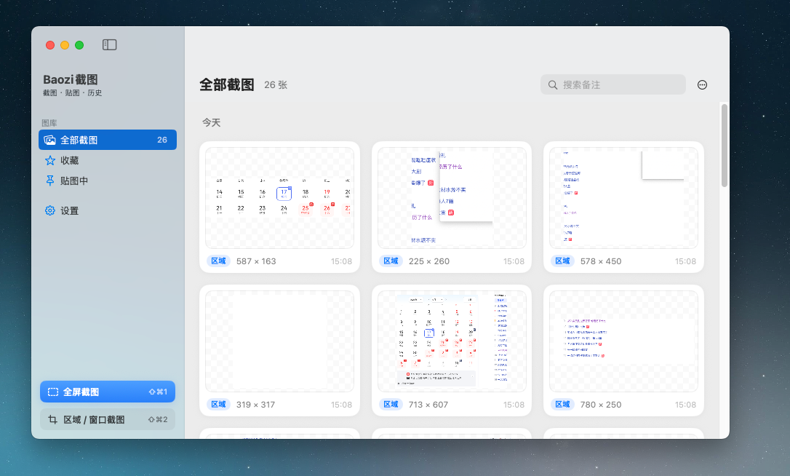

# Baozi截图


## 演示
https://github.com/user-attachments/assets/f82cb1c2-a2df-4a26-b97e-8dd1acd6d804


一款轻量的 macOS 截图工具，支持全局快捷键截图、屏幕贴图、截图历史管理。

基于 Swift + AppKit / SwiftUI 构建，使用 [ScreenCaptureKit](https://developer.apple.com/documentation/screencapturekit) 捕获屏幕。

## 功能

- **全屏 / 区域 / 窗口截图** — 拖拽选区或点击窗口，截图后自动贴到屏幕上
- **屏幕贴图** — 将截图或剪贴板图片钉在桌面最上层，方便对照参考
- **截图历史** — 浏览、搜索、收藏历史截图，支持预览与快速贴图
- **全局快捷键** — 可在设置中自定义，截图时自动复制到剪贴板
- **菜单栏常驻** — 轻量后台运行，支持开机启动

## 环境要求

- macOS 14 (Sonoma) 或更高版本
- [Xcode Command Line Tools](https://developer.apple.com/xcode/resources/)

### 屏幕录制权限

首次运行需要在 **系统设置 → 隐私与安全性 → 屏幕录制** 中允许 `BaoziShot`（或终端）访问屏幕，否则无法截图。

## 快捷键

默认全局快捷键（可在应用内 **设置** 中修改）：

| 快捷键 | 功能 |
| --- | --- |
| ⇧⌘1 | 全屏截图 |
| ⇧⌘2 | 区域 / 窗口截图 |
| ⇧⌘3 | 将剪贴板图片贴到屏幕 |
| ⇧⌘4 | 打开 / 隐藏历史窗口 |
| ⇧⌘5 | 隐藏 / 显示所有贴图 |

截图完成后会自动贴到屏幕上，并复制到剪贴板。

## 贴图操作

| 操作 | 说明 |
| --- | --- |
| 拖动 | 移动贴图 |
| 滚轮 | 缩放 |
| ⌥ + 滚轮 | 调整透明度 |
| 双击 / `Esc` | 关闭贴图 |
| `⌘C` | 复制到剪贴板 |
| `⌘S` | 另存为文件 |
| `0` | 恢复实际大小 |
| 右键菜单 | 复制、另存、调整透明度、关闭全部 |

## 截图历史

历史记录保存在：

```
~/Library/Application Support/BaoziShot/History/
```

| 操作 | 说明 |
| --- | --- |
| 单击 | 选中 |
| 双击 / `↩` | 贴到屏幕 |
| 空格 | 预览 |
| `Delete` | 删除 |
| `⌘C` | 复制 |

收藏的截图不会被自动清理。可在设置中调整历史记录上限。
